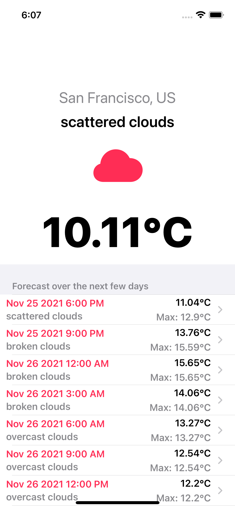

# Weather App

## Overview

A simple client app that allows users to get view the current weather and forecast within the next few days. The app incorporates:

- MVVM+Combine Architecture
- Programmatic UI using UIKit
- Coordinator pattern for routing/navigation
- Parsing JSON using Codable
- Error Handling
- Unit tests using XCTests

## Features

- [x] Fetch/display current and weekly weather details including temperature, weather condition and location from https://api.openweathermap.org/data/2.5
- [x] Get near-future weather forecast details bottomsheet containing temperature, maximum temperature, minimum temperature, humidity, wind speed and visibility after selecting any of the records.

## Custom Features

Some custom features include:

- Rooted/jailbroken device check
- Dark mode compatible
- Optimized for iPhone and iPad

## Requirements

- Swift 5
- iOS 13 and above

## Installation

1. Clone or download the project to your local machine
2. Open `CIB_Absa.xcodeproj` in Xcode
4. Connect physical device and run CMD + R to run on the device
5. Connect physical device and run CMD + U to run the unit tests

## Improvement

- Make UI intuitive.
- Add more security controls e.g. store sensitive data in the KeyChain.